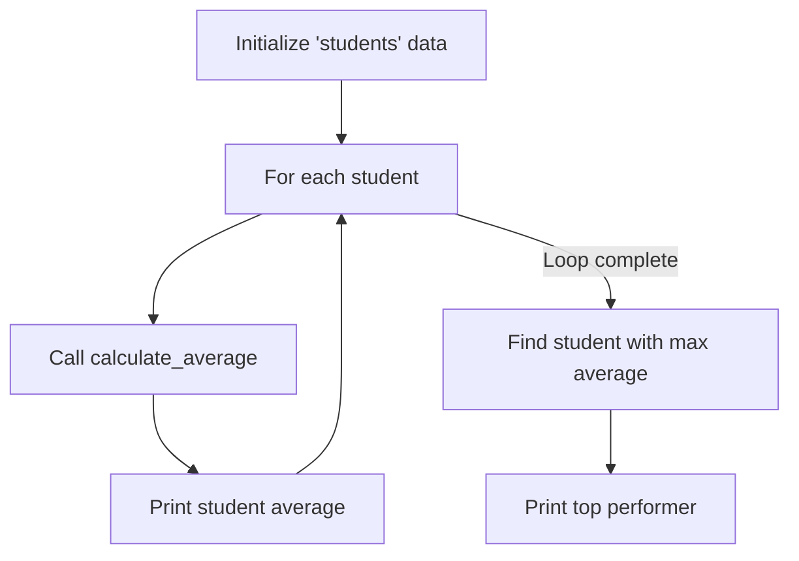

Here is a minimal Mermaid diagram representing the flow of the code:

```mermaid
graph TD
    A[Initialize 'students' data] --> B[For each student]
    B --> C[Call calculate_average]
    C --> D[Print student average]
    D --> B
    B -- Loop complete --> E[Find student with max average]
    E --> F[Print top performer]
```