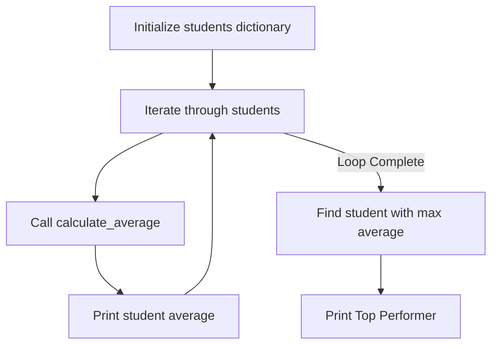

Here is a minimal Mermaid flowchart representing the code flow of `Hello.py`:

```mermaid
flowchart TD
    A[Initialize students dictionary] --> B[Iterate through students]
    B --> C[Call calculate_average]
    C --> D[Print student average]
    D --> B
    B -- Loop Complete --> E[Find student with max average]
    E --> F[Print Top Performer]
```